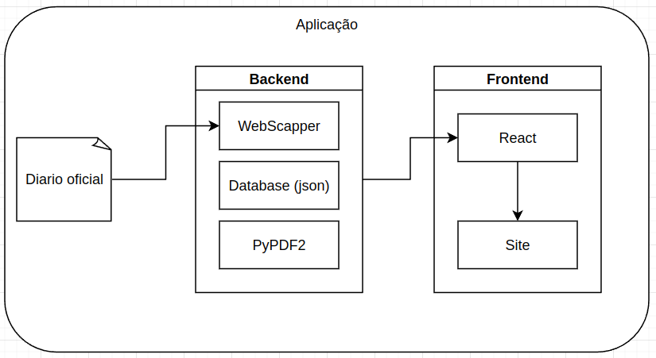

---
hide:
  - navigation
  - toc
---

# Documentação de Arquitetura - LicitaBSB

## Introdução

O projeto LicitaBSB tem como objetivo coletar licitações do site "Meu Querido Diário" relacionadas a Brasília e organizá-las em um feed de rede social. Os usuários poderão realizar buscas avançadas para encontrar licitações específicas de seu interesse.

### Diagrama de Arquitetura

## Camadas

### Camada de Apresentação

A camada de apresentação é responsável por interagir diretamente com o usuário e exibir as informações de forma adequada. Utilizaremos o framework React para desenvolver a interface do usuário, garantindo interatividade, responsividade e uma estilização eficiente.

| Tecnologia    | Versão  |
|---------------|---------|
| React         | 17.0.2  |
| JavaScript    | ES2022  |

### Camada de Dados

A camada de dados é responsável pelo armazenamento e gerenciamento dos dados do sistema. No contexto deste projeto, optaremos por armazenar os dados em formato JSON diretamente no próprio repositório do GitHub. Isso proporcionará uma abordagem simples e acessível para gravar e compartilhar os dados coletados do "Meu Querido Diário".

Essa abordagem elimina a necessidade de utilizar bancos de dados tradicionais como MongoDB ou MySQL, pois os dados serão armazenados como arquivos JSON no repositório do GitHub, aproveitando a infraestrutura existente e facilitando a colaboração entre os membros da equipe.

Dessa forma, não há necessidade de especificar versões de tecnologias relacionadas a bancos de dados, pois estaremos utilizando a infraestrutura nativa do GitHub para armazenamento de dados.

### Camada de Aplicação

A camada de aplicação é responsável pela lógica de negócios e processamento das requisições do cliente. Utilizaremos o framework Django em Python para desenvolver o back-end da aplicação, devido à sua simplicidade e versatilidade. O JavaScript também será utilizado em certas partes da aplicação devido à sua eficiência no tratamento de requisições assíncronas.

| Tecnologia | Versão   |
|------------|----------|
| Django     | 4.1.0    |
| Python     | 3.12.0   |

### Tarefas Agendadas (Chron Job)

Para tarefas agendadas, consideraremos o uso de Python e escolheremos entre Google Cloud ou AWS para hospedagem e execução dessas tarefas, levando em consideração escalabilidade, facilidade de uso e custo.

### Web Scraping e Resgate de Documentos

Para o web scraping e resgate de documentos, utilizaremos Python juntamente com bibliotecas específicas para essa finalidade. A biblioteca PyPDF2 será empregada para o processamento de arquivos PDF, permitindo a extração e manipulação de texto desses documentos.

| Biblioteca | Descrição                                                   |
|------------|--------------------------------------------------------------|
| PyPDF2     | Biblioteca em Python para manipulação de arquivos PDF.       |

## Histórico de Versões

| Data       | Versão | Descrição                               | Autores      |
|------------|--------|-----------------------------------------|--------------|
| 2024-04-12 | 1.0    | Versão inicial da documentação           | Marcelo Adrian |
